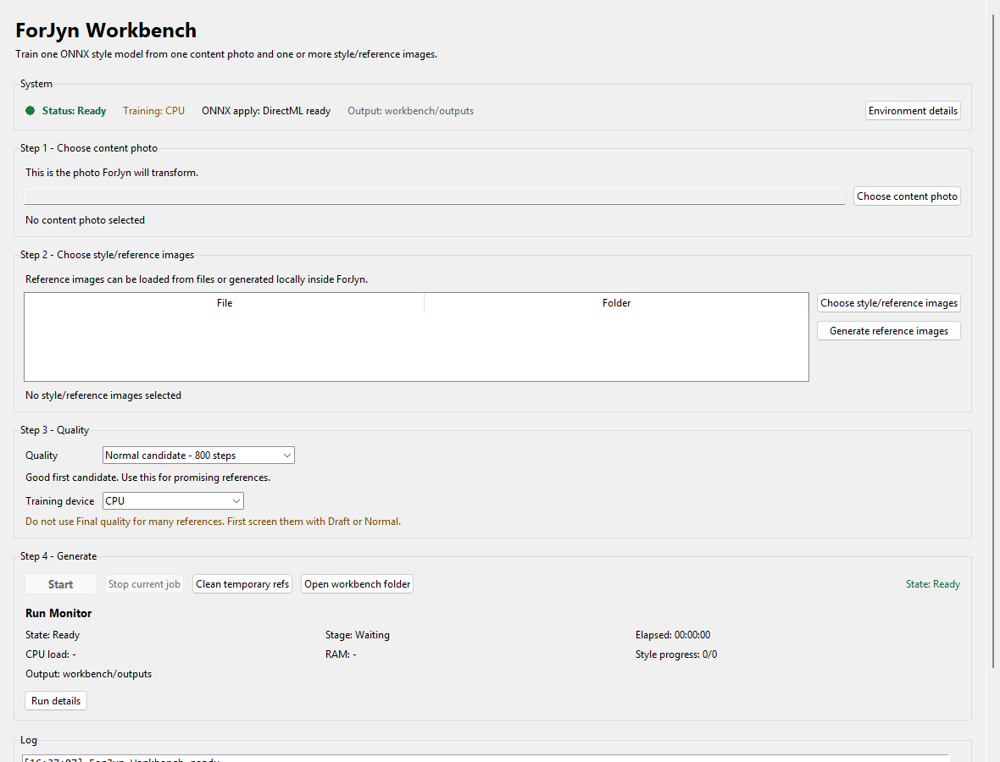
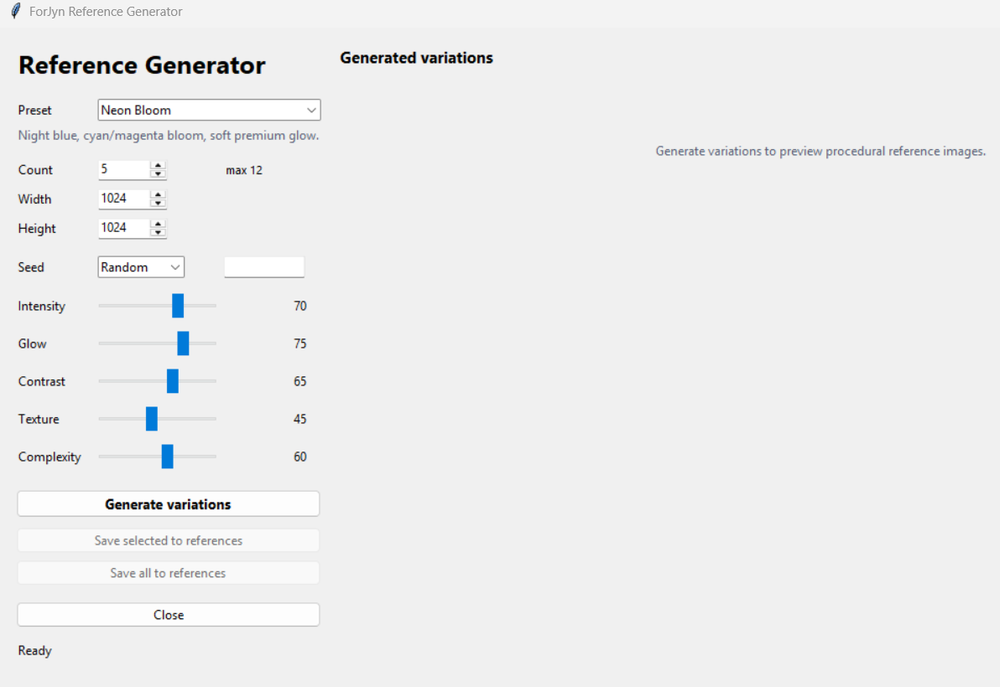

# ForJyn

[](https://github.com/massimomazzariol/forjyn/actions/workflows/ci.yml)


ForJyn is a local Windows/Python workbench for creating, exporting, and testing ONNX style-transfer models from manual or procedurally generated reference images.

It builds on the fast neural style transfer architecture from `yakhyo/fast-neural-style-transfer`, which follows *Perceptual Losses for Real-Time Style Transfer and Super-Resolution* and instance normalization. ForJyn adds a local GUI workflow, procedural reference generation, dynamic H/W ONNX export, review outputs, runtime hygiene, and Windows DirectML integration where available.

ForJyn is not a finished filter pack. It is an experimental local workbench. Visual review is still required before any model is called useful or release-ready.

## Quick Start On Windows

```powershell
git clone https://github.com/massimomazzariol/forjyn.git
cd forjyn
.\setup_windows.bat
.\run_forjyn_workbench.bat
```

`setup_windows.bat` creates a stable CPU runtime in `.venv`. When Python 3.12 and `torch-directml` are available, it also creates an experimental DirectML training runtime in `.venv-gpu`.

`run_forjyn_workbench.bat` auto-selects `.venv-gpu` when the DirectML runtime passes a quick `torch_directml.device()` check. If that runtime is missing or broken, it clearly falls back to the stable CPU `.venv`.

The user-facing workflow is intentionally only those two commands.

## What ForJyn Does

- Choose a content photo from any local path.
- Choose manual style/reference images or generate procedural references locally.
- Train one PyTorch style-transfer model per selected reference.
- Export dynamic height/width, shape-preserving ONNX.
- Validate and apply ONNX locally with CPU fallback and optional ONNX Runtime DirectML.
- Create review sheets for human screening.

## Runtime Model

ForJyn has two local runtimes:

- `.venv`: stable CPU training, ONNX export, and ONNX apply/validation with ONNX Runtime DirectML when available.
- `.venv-gpu`: optional experimental DirectML training runtime using `torch-directml`.

CPU remains the stable fallback. DirectML training is experimental, opt-in inside the GUI, and not guaranteed to be faster. Some operators may fall back to CPU.

## Tested AMD Configuration

Tested locally on:

- AMD Radeon RX 6900 XT
- Windows 11
- Python 3.12.10 for `.venv-gpu`
- PyTorch `2.4.1+cpu`
- `torch-directml 0.2.5.dev240914`
- ONNX Runtime DirectML `1.24.4`
- DirectML device: `privateuseone:0`

This is not a guarantee for all AMD GPUs. Speedups may vary by driver, model size, image size, optimizer behavior, and PyTorch/DirectML compatibility.

## Screenshots

### ForJyn Workbench



### Procedural Reference Generator



## Basic Workflow

1. Choose a content photo.
2. Choose manual reference images or generate procedural references.
3. Pick Draft, Normal, or Final quality.
4. Choose the training device shown by the active runtime.
5. Start the job.
6. Review outputs in `workbench/outputs/`.

Use Draft for screening, Normal for promising candidates, and Final only after a reference is worth the time.

## Runtime Folders

`workbench/` is the only active local runtime root and is ignored by Git.

```text
workbench/
  manual-references/
  final-candidates/
  generated-references/
    saved/
    contact-sheets/
  outputs/
  reviews/
  _runtime/
    cache/
    torch/
    onnx/
    models/
    reports/
    logs/
```

Normal users work mainly in `manual-references/`, `generated-references/`, `outputs/`, and `reviews/`. Technical files, caches, checkpoints, ONNX exports, logs, and validation reports live under `workbench/_runtime/`.

For tests and CI, the runtime root can be redirected with `FORJYN_WORKBENCH_ROOT`.

## Testing

```powershell
.\scripts\run_tests.bat
```

The local test script runs unit tests and compiles the main tools. CI runs on Windows and does not train models, generate ONNX, process content images, or upload artifacts.

## Reproducibility

ForJyn targets functional reproducibility: clone, set up, run the GUI, generate or choose references, train/export ONNX, and review outputs.

It does not promise byte-identical ONNX reproduction. Training output can vary by hardware, PyTorch build, dependency versions, random seeds, and runtime provider. Procedural references record seeds and metadata so candidate sources remain traceable.

## Model And Artifact Policy

Generated checkpoints, ONNX files, `.onnx.data` sidecars, output images, review sheets, contact sheets, caches, copied references, local reports, and the whole `workbench/` runtime are not committed.

The inherited upstream ONNX weights in `weights/` stay tracked as baseline/demo files. Future selected ForJyn models should be distributed as release assets with model cards, attribution, validation results, and known limitations, not written into Git history.

## Third-Party And Upstream Credits

- Upstream project: [`yakhyo/fast-neural-style-transfer`](https://github.com/yakhyo/fast-neural-style-transfer)
- Upstream method: perceptual losses for real-time style transfer and super-resolution, plus instance normalization.
- Core libraries: PyTorch, torchvision, ONNX, ONNX Runtime, Pillow, NumPy.
- Optional Windows inference acceleration: ONNX Runtime DirectML, with CPU fallback.
- Experimental Windows training acceleration: PyTorch DirectML through `torch-directml`.
- Training loss path may use VGG16 pretrained weights through torchvision.

The upstream README states MIT licensing for the original project. See [docs/THIRD_PARTY.md](docs/THIRD_PARTY.md) for attribution, dependency notes, and current license boundaries.

This repository currently has no local `LICENSE` file. License and third-party attribution should be reviewed before wider redistribution.

Do not train or publish models from unclear third-party assets, commercial app presets, copied UI assets, proprietary model files, or references whose provenance is not documented.

## Documentation

- [Workbench guide](docs/WORKBENCH.md)
- [Experimental DirectML training](docs/GPU_TRAINING_EXPERIMENTAL.md)
- [Next steps](docs/NEXT_STEPS.md)
- [Project scope](docs/PROJECT_SCOPE.md)
- [Model policy](docs/MODEL_POLICY.md)
- [Third-party notes](docs/THIRD_PARTY.md)
- [Worklog](docs/WORKLOG.md)
